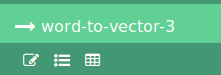

# Clustering

##  What is the clustering technique?

According tho Wikipedia, **clustering** is the task of grouping a set of objects
in the same group (called **cluster**) are more similar (in some sense or another)
to each other than to those in other groups (clusters). It is a main task of 
exploratory data mining and a common techninique for statistical analysis, used
in many fields, including machine learning, pattern recognition, image analysis,
information retrieval, bioinformatics, data compression and computer graphics. 

##  Clustering numerical data

### Iris species dataset

## Tutorial: Extracting topics from text

When applying clustering to textual data, the task is known as **document clustering**. 
Documents, containing the textual data, can be clustered by their topics. So, we
need to execute **topic extraction** over the dataset. As result, we are going
to have two results: a dataset containing the topics and their most important words and a second dataset containing the documents themselves plus the probability of each 
document to belong to each topic. 

### Extracting topics with LDA
We are not going to detail or present the concepts of LDA (Latent Dirichlet 
allocation). For more information, see:

- http://blog.echen.me/2011/08/22/introduction-to-latent-dirichlet-allocation/
- https://blog.knoldus.com/2016/10/08/spark-lda-clustering/

### News headlines dataset

For this tutorial, we are going to use a dataset called News Aggregator Dataset&nbsp;[LICHMAN2013], available at https://www.kaggle.com/uciml/news-aggregator-dataset 
dataset. This dataset contains headlines, URLs, and categories (e.g. business,
science and technology; entertainment; health) for 422,937 news stories collected by a web aggregator between March 10th, 2014 and August 10th, 2014.

**Important**: This tutorial assumes the dataset is already uploaded to Lemonade platform. If it is not, please refer the documentation about uploading datasets to Lemonade.

#### Preparing the data

1. Create a new workflow in Lemonade. Give it the name: *"News headline topic detection"*.
2. Locate and drag a **Data reader** operation to the workflow are. It is available
in the toolbox (left side), under the category **Data source and target**.
3. Click the task **Data reader** and, in the **Properties window** (right side),
select *uci-news-aggregator.csv.gz* in the list of available data sources. Ensure to
check the box **Use first row as header**. In **Infer data source schema**, select
*From metadata (recommended)* and, finally, for **What to do in case of invalid data**, 
select *Stop processing and raise error*. 
4. In the toolbox, open the category **Data transformation** and drag the operation **Sample**, the **Transformation** operation and then the **Projection/Select columns** to the workflow design area.
5. Drag a connection between the **Data reader** and the **Sample**, then from
the **Sample** to the **Projection/Select columns** and then from **Projection/Select columns** to **Transformation**, always connecting the output of one task to the input of the other. For the **Sample** task, configure its **Type of sampling or partition** property to *Extract top N records from data* and **Total of records** to 100. For **Projection/Select columns**, for the **Attributes** property, select the attributes *CATEGORY*, *HOSTNAME* and *TITLE*. For the **Transformation** task, set the **Name of transformed attribute** to *TITLE_LOWER* and the **Expression** to *lower(TITLE)*.
6. Again, in the toolbox, open the category **Text processing** and drag the operations
**Tokenizer**, **Remove stop words** and **Convert words to vector** to the design area.
For **Tokenizer**, set its properties **Type**, **Attributes** and **Alias** to *Simple, use spaces as delimiters*, *TITLE_LOWER* and *TITLE_TOKENS*, respectively. For **Remove stop words**, set the properties **Attributes**, **Alias** and **Language** for *TITLE_TOKENS*, *TITLE_NO_STOPS* and *English*. The last task to be configured is **Convert word to vectors**. Set the properties **Attrbutes** and **Alias** to *TITLE_NO_STOPS* and *FEATURES* and ensure the value of **Type** is *Count term frequency*. Set the **Vocabulary size** to 4096.
7. Connect the output of **Transformation** to the input of **Tokenizer**; the output of **Tokenizer** to the input of **Remove stop words** (left input, named *input data*, left the other input without connection) and **Remove stop words** to **Convert words to vector**. 
8. Save your workflow.

At this point, your workflow may be similar to the shown in the figure below:

Let's understand what we have done. First, we are specifying the dataset to be read by the workflow. The **Sample** task is limiting the amount of data we are working. It's good idea do limit it in order to run and get feedback fast. Later, we can remove the **Sample** and run the workflow for the entire dataset. We are also discarding some attributes from the dataset we are not going to use in this tutorial. The attributes still are in the dataset, only will not be available after the **Projection/Select columns**.

Next 4 tasks are related to *transformation* or *feature engineering*: we are preparing the dataset to be used as input for the clustering algorithm. First, we convert the texto to lower case (in **Transformation** task), so words in different cases will not be considered different. The **Tokenizer** task breaks the news title (a sentence) into individual words. The **Remove stop words** removes words commonly used in the language (in the case, English) and so they are not good to separate the clusters (they may occur as the most important words in all topics, if they are not removed).

The cluster algorithm will use the vector of words (bag of words) as features, but first, we need to convert it to a numerical representation. Many algorithms works only with numerical data and if we have only categorical or textual ones, we need first to perform the conversion. Some processing platforms supported by Lemonade, such as Spark, only accepts numerical features for most of machine learning algorithms. In the example, we are using the *Count term frequency*. This implementation will read all the documents in the dataset and count the number of occurrences of each word in the documents. The top **Vocabulary size** (in the case, 4096), ordered by the frequency,will be used to convert the word vector into a numerical vector. 

#### Testing the current progress

In Lemonade, an easy way to see the results is by taking a sample of data. Let's assume everything is OK and configure the workflow to display a sample only for the last task, **Convert words to vector**. 

1. Click this task and in the **Properties** in the **Results** area, check the box *Display sample(s) of output(s) (max. 50 records)*. 
2. Save your workflow again and click the button **Execute**.
3. In the **Results** area, click in **Convert words to vector**. You will be able to see the attributes selected in the projection and the generated by the other tasks by clicking the button displaying a table icon (see below) in the job result area (right side). 

4. Click the link *Sample data for vocabulary* to display the table.

If there is an error, review the previous steps.

#### Adding the LDA algorithm and creating the clustering model
1. Close the results window and then click the button *Workflow* to go back to the workflow design mode. 
2. Drag, from the toolbox, under the option *Machine Learning > Clustering*, the operation **Clustering model** to the design area. Do the same to the operation **LDA Clustering**. 
3. Connect the output data from **Convert words to vector** (port from the right) to the first input port of the **Clustering model**.
4. Connect the output of **LDA Clustering** to the second input port of  the **Clustering model**.
5. Change the properties of **Clustering model**: *Features attribute* must be *FEATURES* and "Prediction" must be "PREDICTION". Under the *Results* area, mark the checkbox for *Display sample(s) of output(s) (max. 50 records)*.
6. You do not need to change the **LDA Clustering** now. 
7. Save and execute the workflow again.
8. See the results of the sample for the **Clustering model** task as we did previously. You may see a new attribute called *topicDistribution*. 

The attribute *topicDistribution* contains a vector with the probabilities of the document be in each one of the 10 clusters. The amount of clusters, 10, is the default for the **LDA Clustering** task. You can change this property and see the results later. 

Other datasets:

https://www.kaggle.com/therohk/million-headlines

Color quantization
https://gallery.cortanaintelligence.com/Experiment/Clustering-Color-quantization-4

Churn
https://github.com/dneled/Azure-ML-Churn-Tutorial

## References
[LICHMAN2013] Lichman, M. (2013). UCI Machine Learning Repository [http://archive.ics.uci.edu/ml]. Irvine, CA: University of California, School of Information and Computer Science.4096